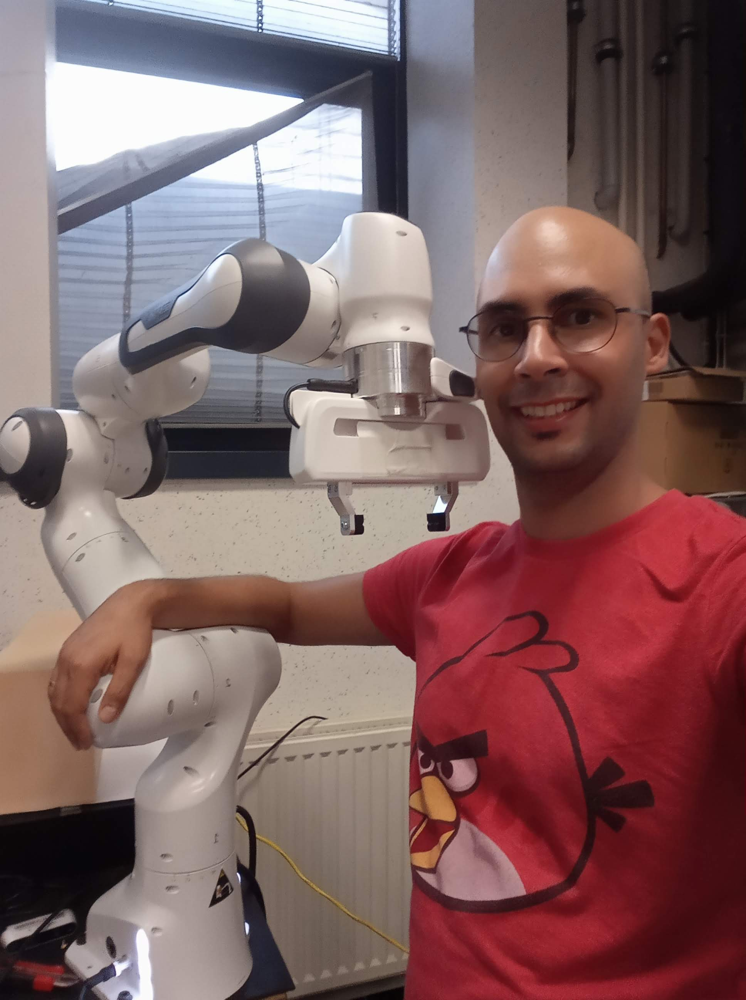

# Berk Tepebag - Robotics Engineer

##  My motto:
A robotics engineer with interest in making humans lives easier with developing solutions to daily problems such as autonomous driving, robots helping humans and automatization in heavy industry.

## Profile:

I have studied mining engineering at METU and worked as a mining engineer for 1.5 years where I have written a simple ERP program that was used to control the shifts. Left the job for military service and later, I have started working at a cement factory. Seeing how hard it is for humans to work in heavy industries I have started to think about finding ways to replace humans with robots. This intention took me to Udacity where I have learned cores of Deep learning and Self-driving cars. As I studied online I have started looking for more conventional education and started robotics and materials master at SIGMA Clermont, France where had a chance to see all kind of robots in action (Kuka, Baxter, Franka-Emika Panda, parallel robots, serial robots...). Had my master's degree in September 2019 and now I am looking for an opportunity where I can keep my hard work on.

### Latest Repos:
<iframe width="560" height="315" src="https://www.youtube.com/embed/videoseries?list=PL60qgWqGu6k92qRRZMmyh6v1JRZck_S3a" title="YouTube video player" frameborder="0" allow="accelerometer; autoplay; clipboard-write; encrypted-media; gyroscope; picture-in-picture; web-share" allowfullscreen></iframe>

* <a href="https://github.com/berktepebag/self_driving_car_navigation"> Navigation ROS package </a> for self-driving autonomous RC car . Repository includes 
  1. SLAM with Gmapping
  2. Localization with AMCL
  3. An AMCL tweaking tool with a rosbag
 
* <a href="https://github.com/berktepebag/Extended-Kalman-Filter-ROS"> Kalman Filter ROS package </a> for fusing IMU and wheel encoder data from self-driving autonomous RC car. 
* Adapted <a href="https://github.com/berktepebag/BOSCH-BMI160-ROS-Library"> BOSCH BMI160 6 DOF IMU drivers </a> to ROS. 
* <a href="https://berktepebag.github.io/Traffic-light-detection-with-YOLOv3-BOSCH-traffic-light-dataset/"> Traffic light detector with YOLOv3 </a>  and BOSCH small traffic light dataset. Repository includes 
1. Connection to Carla Simulator
2. Connection from Carla to ROS for detection
3. Detection from video input
